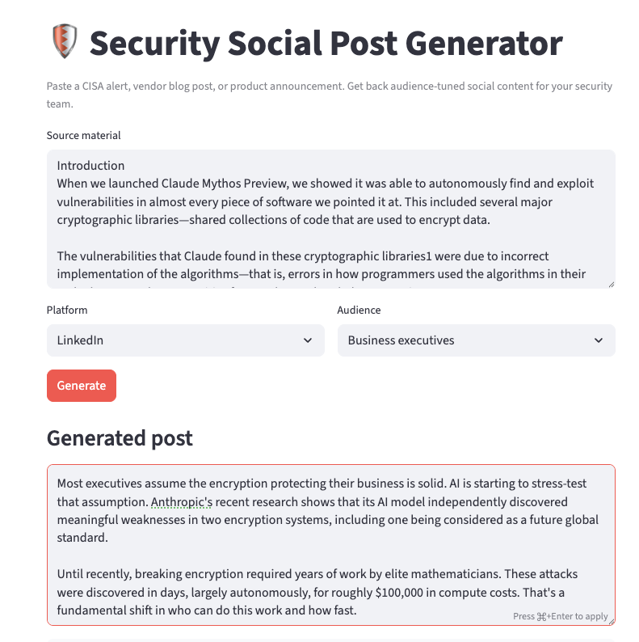
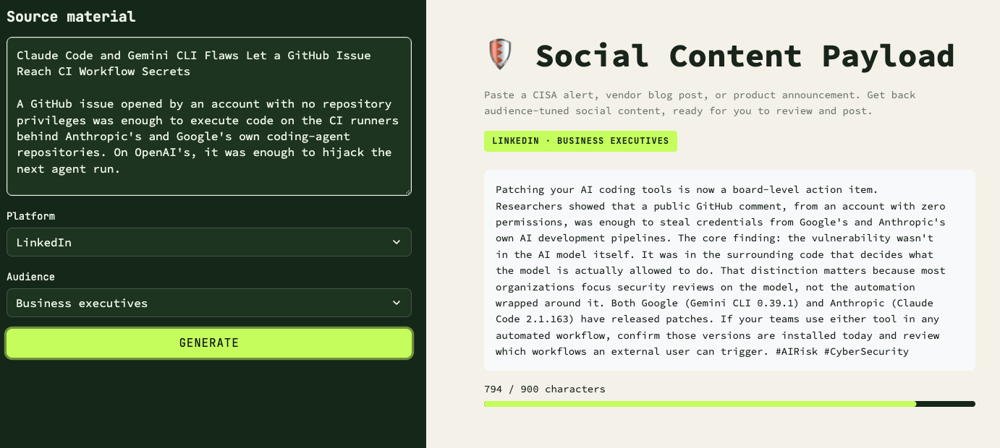

# Social Content Payload

_A small AI tool that turns security news into audience-tuned social content — LinkedIn, X, and executive-summary formats — for cybersecurity marketers and comms teams._

> 🚧 Work in progress — Day 4 of a 7-day build. See commit history for the progression.

## Problem

Security marketers and comms teams constantly need to translate the same source
material (a CISA alert, a vendor blog post, a product announcement) into different
formats for different audiences — a LinkedIn post for practitioners reads nothing
like an executive briefing. Doing this by hand for every piece of news is slow.

## Solution

Paste in source text, pick a platform and an audience, and get back a
ready-to-use draft tuned to both.

## Architecture

- **Streamlit** for the UI
- **Anthropic API (Claude)** for generation
- Prompt templates in `prompts.py` separate platform and audience instructions,
  so tone and structure can be tuned independently

## Screenshots / Demo

Before (Day 1, before UI polish):



After (Day 4, full restyle):



## Running locally

```bash
python -m venv .venv
source .venv/bin/activate
pip install -r requirements.txt
export ANTHROPIC_API_KEY=sk-...
streamlit run app.py
```

## Roadmap

- [x] Audience-aware tone controls (Day 3)
- [x] UI polish + copy button (Day 4)
- [ ] Tested against real CISA alerts / vendor posts (Day 5)
- [ ] Public deploy (Day 6)
- [ ] Demo GIF + lessons learned (Day 7)

## Lessons learned (Day 1)

- **Prompt instructions aren't reliable for hard constraints.** Telling the model "never use an em dash" and "stay under 900 characters" wasn't enough, it violated both repeatedly. The fix was enforcing them in code: stripping em dashes with a deterministic string replace, and adding an automatic "shorten this" follow-up call when the model overshoots the character limit. Lesson: prompting sets intent, code enforces rules.
- **Testing against real source material surfaces problems placeholder text never would.** The character limit and em-dash issues only showed up once I ran the generator against an actual breaking-news security incident, not a made-up example. Real content is messier and pushes the model toward its default habits.
- **Verify before you publish.** Before trusting an AI-generated summary of a security incident, I checked the model's output against the original source article.

## Lessons learned (Day 2)

- **A shared call to action across audiences is a tell that the prompt isn't actually differentiating.** The fix was explicit: ground the takeaway in what that specific audience would do or feel (a priority signal for practitioners, a decision or question for executives, relevance for the general public), not the same instruction restated in simpler words.
- **Constraint-heavy platforms (X's 280 characters) need explicit protection for the "soft" elements, not just the facts.** When the model has to cut for length, it defaults to trimming the ending first, exactly where the hook and the engagement question live. Adding "keep the ending, cut supporting detail first" to the shorten-prompt logic protects the part of the post most likely to drive replies.

## Lessons learned (Day 4)

- **Streamlit doesn't officially support deep CSS customization, so styling native components takes real trial and error.**
- **A name with personality changes how a project reads.** Renaming from "Security Social Post Generator" to "Social Content Payload" didn't change any functionality, but it made the project feel like an intentional product instead of a literal description of what the code does.
